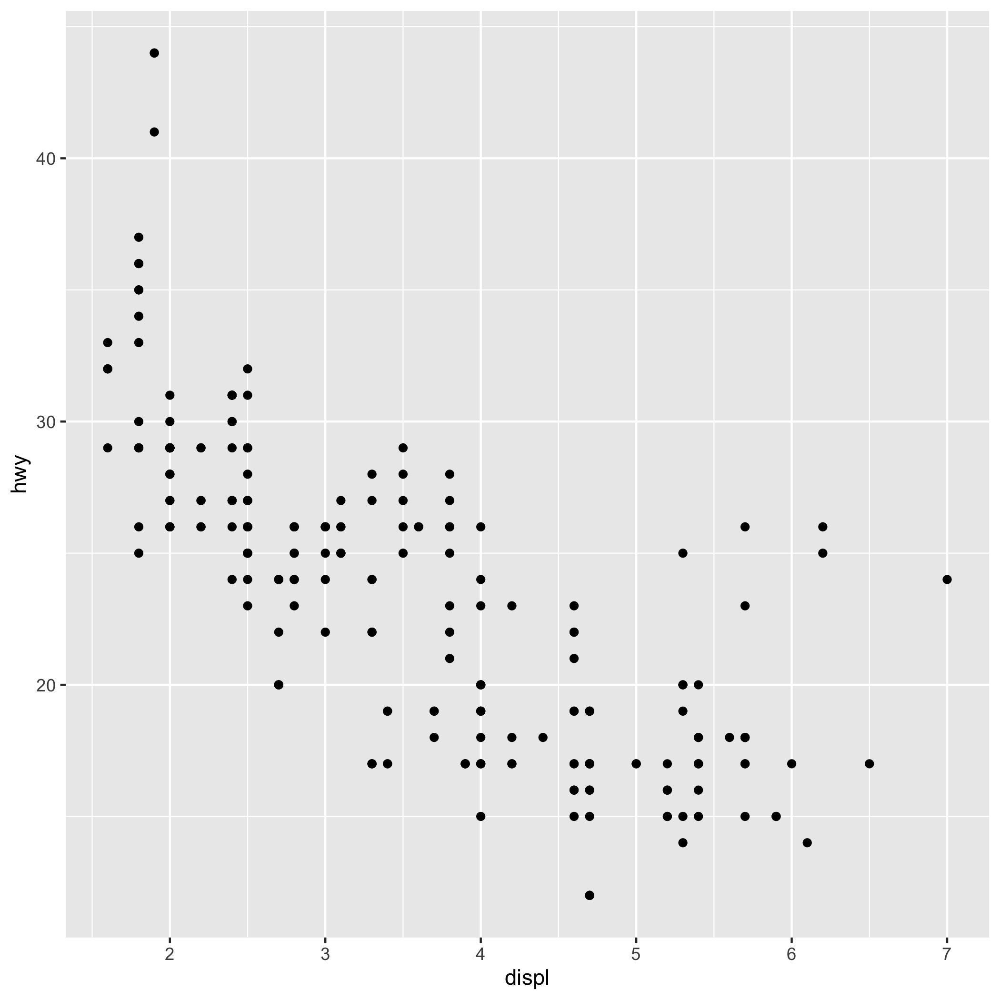

params:
   species: "setosa"
these parameter above allow for dynamically generated reports


```{r setup, include = FALSE}
library(ggplot2)
library(dplyr)
 
```

```{r plot, include=FALSE}

species <- iris$Species

data <- iris %>% 
  filter(Species == species) %>% 
  select(Species, starts_with("Petal")) 
```
Here is a  table with `r nrow(data)` irises from the species Setosa

```{r, echo=FALSE}
data %>% 
  ggplot(aes(Petal.Length, Petal.Width))+
  geom_point() +
  xlab("Petal Width")+
  ylab("Petal Length")+
  ggtitle("my Graph")
  
```

this is *italic* so is _this_
**bold**
this is code formatted
#header 1
##header 2
###header 3
<http:www.google.com>

[Google](http://www.google.com)



Column one | Column two
-----------|-----------
cell 1     |cell2

```{r}
Apex_Testing
```

